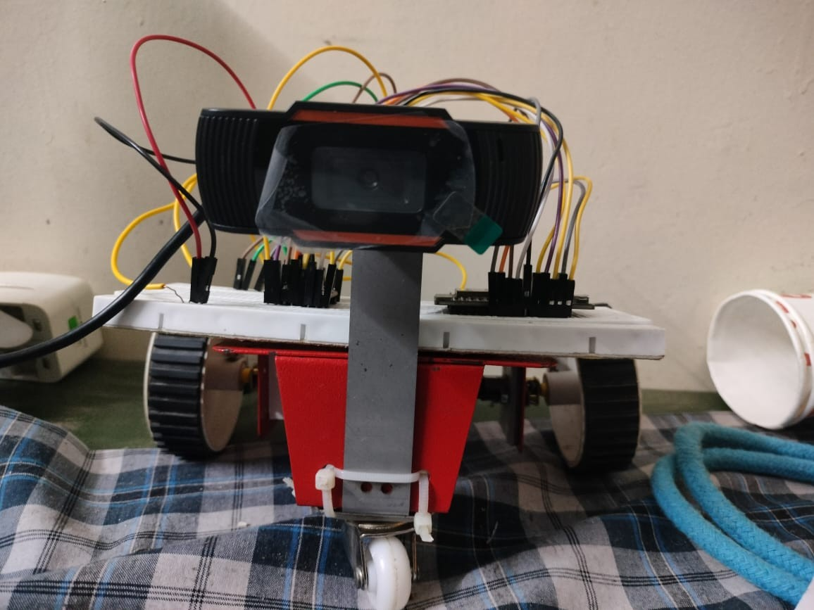
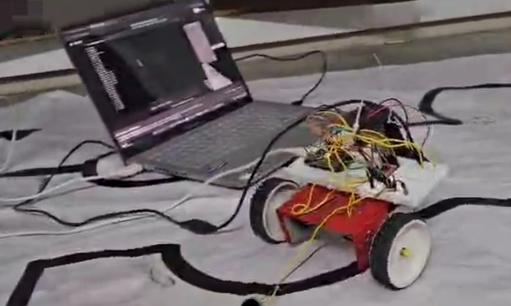

# Vision-Based Multi-Color Line Follower Robot

A vision-based autonomous line-following robot that detects and follows **red, green, and black lines** using **Python, OpenCV, a USB camera, and ESP32**.

The laptop performs real-time image processing using OpenCV. Based on the detected line position, movement commands are sent to the ESP32 through serial communication. The ESP32 controls two N20 geared motors using an L298N motor driver.

---

## 📌 Project Overview

This project demonstrates the use of **computer vision and embedded systems** to build an autonomous line-following robot.

A USB camera captures the path in front of the robot. The camera feed is processed on a laptop using Python and OpenCV. The system detects the selected line color, finds its position, and determines the required direction.

The movement command is then transmitted to the ESP32 through serial communication.

The ESP32 receives the command and controls the N20 geared motors through the L298N motor driver.

---

## 🎯 Objectives

* Detect red, green, and black lines using computer vision.
* Process camera frames in real time.
* Calculate the position of the detected line.
* Determine the direction of robot movement.
* Send movement commands from Python to ESP32.
* Control two DC geared motors using an L298N motor driver.
* Implement normal and sharp turns.

---

## ✨ Features

* 🔴 Red line detection
* 🟢 Green line detection
* ⚫ Black line detection
* 📷 Real-time camera-based image processing
* 🧠 OpenCV-based computer vision
* 🎯 Centroid-based line tracking
* ↩️ Left and right turning
* 🔄 Sharp turn detection
* 📡 Serial communication between laptop and ESP32
* ⚙️ N20 geared motor control
* 🛑 Stop command when the line is not detected
* 🔧 L298N motor driver control

---

## 🛠️ Hardware Used

| Component            | Purpose                              |
| -------------------- | ------------------------------------ |
| ESP32                | Motor control and command processing |
| USB Camera / Webcam  | Captures the path                    |
| Laptop               | Real-time image processing           |
| L298N Motor Driver   | Controls the DC motors               |
| N20 Geared Motors    | Robot movement                       |
| Robot Chassis        | Mechanical structure                 |
| Adapter Power Supply | Provides power to the robot          |
| Connecting Wires     | Electrical connections               |

> **Note:** The robot is powered using an external adapter power supply rather than a battery.

---

## 💻 Software and Technologies

* Python
* OpenCV
* NumPy
* PySerial
* Arduino IDE
* ESP32
* L298N
* Computer Vision
* Serial / UART Communication

---

## 🔄 System Architecture

```text
                    USB Camera
                        |
                        v
                 +-------------+
                 |   Laptop    |
                 | Python +    |
                 |   OpenCV    |
                 +------+------+
                        |
                 Line Detection
                        |
                 Centroid Position
                        |
                 Direction Decision
                        |
                Serial Communication
                        |
                        v
                   +---------+
                   |  ESP32  |
                   +----+----+
                        |
                        v
                   +---------+
                   |  L298N  |
                   |   Motor |
                   |  Driver |
                   +----+----+
                        |
                 +------+------+
                 |             |
                 v             v
             N20 Motor     N20 Motor
                 |             |
                 +------+------+
                        |
                        v
                   Robot Motion
```

---

## 🧠 Working Principle

### 1. Camera Capture

The USB camera continuously captures the path in front of the robot.

The laptop processes the camera feed using OpenCV.

The camera is configured to capture frames at approximately **320 × 240 pixels**.

```python
cap = cv2.VideoCapture(1, cv2.CAP_DSHOW)

cap.set(cv2.CAP_PROP_FRAME_WIDTH, 320)
cap.set(cv2.CAP_PROP_FRAME_HEIGHT, 240)
cap.set(cv2.CAP_PROP_FPS, 60)
```

---

### 2. Red and Green Line Detection

For red and green line detection, the camera frame is converted from BGR to HSV color space.

```python
hsv = cv2.cvtColor(frame, cv2.COLOR_BGR2HSV)
```

HSV thresholding is then used to create a mask for the selected color.

For red detection, two HSV ranges are used because red appears near both ends of the HSV hue range.

For green detection, an HSV range is used to isolate the green path.

---

### 3. Black Line Detection

For black-line detection, the image is converted to grayscale and thresholded.

```python
gray = cv2.cvtColor(frame, cv2.COLOR_BGR2GRAY)

_, mask = cv2.threshold(
    gray,
    40,
    255,
    cv2.THRESH_BINARY_INV
)
```

This creates a binary mask that can be used to detect the dark line.

---

### 4. Noise Removal

Morphological operations are used to reduce noise in the detected mask.

```python
kernel = np.ones((5, 5), np.uint8)

mask = cv2.morphologyEx(
    mask,
    cv2.MORPH_OPEN,
    kernel
)

mask = cv2.morphologyEx(
    mask,
    cv2.MORPH_CLOSE,
    kernel
)
```

These operations help remove small unwanted regions and improve contour detection.

---

### 5. Contour Detection

The largest detected contour is selected as the main line.

The centroid of the contour is calculated using image moments.

```python
M = cv2.moments(c)

cx = int(M['m10'] / M['m00'])
cy = int(M['m01'] / M['m00'])
```

The `cx` value represents the horizontal position of the detected line in the camera frame.

This position is used to determine whether the robot should move left, right, or forward.

---

### 6. Direction Decision

The camera frame is divided into left, center, and right regions.

```text
+-----------------------------------------+
|                                         |
|        LEFT     CENTER       RIGHT      |
|          |         |            |       |
|          |         |            |       |
+-----------------------------------------+
```

The robot determines its movement based on the detected centroid.

| Condition        | Command | Movement    |
| ---------------- | ------- | ----------- |
| Line in center   | `F`     | Forward     |
| Line on left     | `L`     | Left        |
| Line on right    | `R`     | Right       |
| Sharp left       | `Q`     | Sharp Left  |
| Sharp right      | `E`     | Sharp Right |
| No line detected | `S`     | Stop        |

---

## 📡 Laptop–ESP32 Communication

Python communicates with the ESP32 using the **PySerial** library.

The current Python program uses:

```python
esp32 = serial.Serial('COM4', 9600, timeout=1)
```

The `COM4` port should be changed according to the port assigned to the ESP32 on the user's computer.

The baud rate is:

```text
9600
```

Movement commands are sent as single characters.

For example:

```python
esp32.write(b'F')
```

This sends the forward command to the ESP32.

### Command Table

```text
F → Forward
L → Left
R → Right
Q → Sharp Left
E → Sharp Right
S → Stop
```

---

## ⚙️ Motor Control

The ESP32 receives the commands from the Python program and controls the two N20 geared motors through the L298N motor driver.

The ESP32 motor-control program is located at:

```text
esp32/motor_controller.ino
```

> **Important:** The GPIO pin configuration in the ESP32 program must match the actual wiring used between the ESP32 and L298N motor driver.

---

## 📁 Project Structure

```text
vision-based-multicolor-line-follower/
│
├── README.md
├── .gitignore
├── LICENSE
├── requirements.txt
│
├── Python/
│   ├── Red line follower.py
│   ├── Green line follower.py
│   └── Black line follower.py
│
├── esp32/
│   └── motor_controller.ino
│
├── line_follower_1.jpg
├── line_follower_2.jpg
└── line_follower_demo.mp4
```

---

## 📦 Installation

Clone the repository:

```bash
git clone https://github.com/YOUR-USERNAME/vision-based-multicolor-line-follower.git
```

Move into the project directory:

```bash
cd vision-based-multicolor-line-follower
```

Install the required Python libraries:

```bash
pip install -r requirements.txt
```

### Required Python Libraries

```text
opencv-python
numpy
pyserial
```

---

## 🚀 How to Run

### 1. Upload ESP32 Code

Open the following file in Arduino IDE:

```text
esp32/motor_controller.ino
```

Select the appropriate ESP32 board and upload the program.

---

### 2. Connect the ESP32

Connect the ESP32 to the laptop through USB.

Check the COM port assigned to the ESP32.

The current Python code uses:

```python
esp32 = serial.Serial('COM4', 9600, timeout=1)
```

If your ESP32 uses another port, change `COM4` accordingly.

For example:

```python
esp32 = serial.Serial('COM5', 9600, timeout=1)
```

---

### 3. Connect the Camera

Connect the USB camera to the laptop.

The current program uses:

```python
cap = cv2.VideoCapture(1, cv2.CAP_DSHOW)
```

If the camera is not detected, try changing the camera index:

```python
cap = cv2.VideoCapture(0, cv2.CAP_DSHOW)
```

---

### 4. Run the Python Program

#### Red Line Detection

```bash
python "Python/Red line follower.py"
```

#### Green Line Detection

```bash
python "Python/Green line follower.py"
```

#### Black Line Detection

```bash
python "Python/Black line follower.py"
```

Press **Q** to close the camera window and stop the program.

---

## 📷 Project Images

### Robot Prototype



### Robot in Action



---

## 🎥 Demonstration

The following video demonstrates the vision-based line-following robot in operation.

[▶️ Watch the Line Follower Demo](line_follower_demo.mp4)

---

## 🏆 Results

The prototype successfully demonstrated vision-based line following using a laptop, USB camera, OpenCV, ESP32, and motor-control hardware.

The robot was able to:

* Detect red, green, and black lines.
* Follow straight paths.
* Perform left and right turns.
* Detect sharp turns.
* Send movement commands from the laptop to the ESP32.
* Control N20 geared motors through the L298N motor driver.

---

## 🔮 Future Improvements

Possible improvements for future versions include:

* PID-based steering control
* Automatic color calibration
* Adaptive HSV thresholding
* Improved performance under changing lighting conditions
* Wireless communication between laptop and ESP32
* On-board image processing
* Obstacle detection
* Automatic speed adjustment
* Intersection detection
* Automatic line-color selection
* Improved sharp-turn handling

---

## 🧰 Technologies

`Python` `OpenCV` `NumPy` `PySerial` `ESP32` `Arduino` `L298N` `N20 Geared Motor` `Computer Vision` `Robotics`

---

## 📌 Project Type

**Mini Project – Robotics, Computer Vision and Embedded Systems**

---

## 👨‍💻 Project Summary

This project combines **computer vision, Python programming, serial communication, embedded systems, and robotics** to create a camera-based autonomous line-following robot.

The system demonstrates how a laptop can perform real-time image processing while an ESP32 handles the motor-control operation of the robot.
